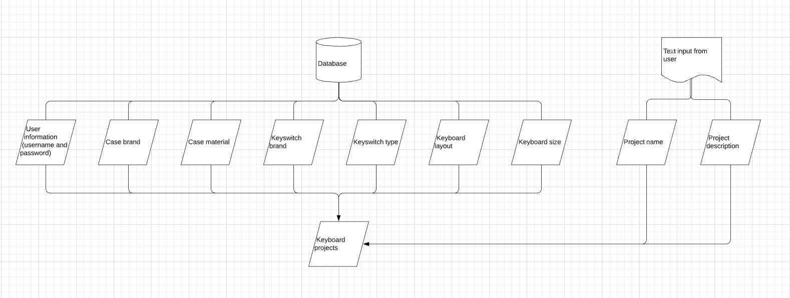

<h1 align="center">
  
</h1>

[View this website through Heroku](https://rate-my-mech.herokuapp.com/) 

Rate My Mech is a community platform for keyboard enthusiats. The application contains different pages depending of if the user is logged in or not. 
If the user is not logged in the site displays, a home page, a keyboard page for viewing shared keyboards, a login/sign up page and an about page.
If the user is logged in a profile page and a page for building and sharing keyboard are available. The logged in user is also able to edit and delete their own keyboards. 

Rate My Mech was developed by a keyboard enthusiast for other keyboard enthusiats. The main purpose is for users to share their mechanical keyboards and find inspiration from others for their next build. 
The idea of the application is to make it user friendly and as a wise man once said: "good design is invisable", thus the application is kept as clean as possible. 

The goal of the application is:
* Host a user firendly environment which is intuitive by nature
* Provide both front end usability and back end functionality in order to create a full application experience 
* Spread joy

The users goals are:
* Share their keybords 
* Gain inspiration from other keyboards 

## UX

#### Ideal users are:
* English speaking
* Keyboard enthusiats

#### Users are searching for:
* A community platform for mechanical keyboards 
* A user friendly website which is responsive and suitable for both larger monitors and smaller screen sizes

#### This application make it easy for users to share and gain inspiraton because:
* It is intuitive and easy to use 
* It contains only neccesary features, thus reaching the statement above
* The application provides filter functionality which makes it easier for the user to find what they want

#### User stories 
* As a first time visitor, I want to view others mechanical keyboards to get inspiration
* As a first time visitor, I want to register for an account
* As a first time visitor, I want to (in a simpel way) use the platform to build and share my own mechanical keyboard
* As a returning visitor, I want to be able to log back into my previosly registrated user
* As a returning visitor, I want to be able change previous projects and upload new projects

#### Balsamiq mockups

## Featureas

### Navigation bar and footer 

The navbar take two shapes depending if the user is logged in or not. If the user is not logged in the following navbar is displayed:

In this format, the navbar is kept very simplistic. The logotype is located to the left and when clicked takes the user to the home page. 
To the right we find the home button, the keyboard button and a login button. 
The keyboard button takes the user to the page to view uploaded keyboard while the login button takes the user to the login/registration page.

If the user is logged in, more options are available: 

Here we add more options to the user. The user is now able to view their own profile page displaying their uploaded keyboards and also build a new keyboard to share. 

The footer remains the same, not depending of the user being logged in or not:

The footer contains three parts. First a link to the about page and beneath it a copyright statement and a recognition that the front end was built using the Materialize library.

### Home 

At the home page the user is displayed with the logotype, a short statement. and a picture of "keyboard of the week".
Further down, two bottons are displayed. If the user is not logged in, the two buttons will be "keyboards" and "login/sign up".
If the user is logged in, the buttons will be "keyboards" and "Share your keyboard". 

### Keyboards 

At the keyboards page, the user will be able to view all keyboards that has been uploaded to the community. 
The user will be able to sort the keyboards depending on case material, keyboard size and layout. 
The user can also clear the filters by clicking the button "clear filters". 

On all keyboard cards, the button "view keyboard" is available. If clicked, the user will be sent to a page with a more indepth view of the specific keyboard.

### View specific keyboard 

When the "View keyboard" button is clicked on the previous page, the user will get more information of the keyboard of their choice. 
Here, the user can see the full description of the keyboard, who created it, an enlarged picture, what switches are used, from which brand the components are from and more. 

This page also include an "edit button" if the user is the creator of the keyboard. This button will take the user to the edit/delete page which is presented further down in this README. 

### Login / Registration 

The login page is simple with two options. Either the user have an account and can use the login function. 
If the user does not have an accout the option of register is presented. If the user click the option to register an account the user will be presented with a page similar to the login page.
When registration is complete, the user will be redirected to the loginpage.

### Profile / My keyboards

My keyboards is visible for logged in users only. At this page, all the projects created by the logged in user is gathered. 
From this page, the user can easily view their own keybords in depth and from there edit or delete the keyboards. 
Below the kayboards an option for sharing another keyboards is displayed. 

If the user have no shared keyboards the page will display a text with this information, and the user have the option to share their first keyboard. 

### Build keyboard 

When the logged in user want to share their keyboard, they are faced with an intuitive way of doing so. 
The user need to name the project and describe it. These two input fields are the only two required for the upload to pass the system. 
The other options to pass in are displayed in dropdown menues with alternative. These dropdown menues cover case information, switch information and layout/size information. 
The user is also able to pass in a URL for the keyboard if desired. 

The keyboard is passed to the database when the save button is clicked. 

### Edit / Delete  

As mentioned above, the user will be displayed with the option to edit a keyboard on the indepth view page if they are the creator of the specific keyboard. 
The edit/delete page look identical to the "build" page except that the fields are filled in based on the information from when the keyboard first was built or from the last edit. 
Also, instead of the save bottom on the bottom of the page, the user now have the option to save the changes or delete the keyboard. 

### About 

The about page contain the Rate My Mech logo and a short text why the application was created and whom it is for. 

### Database 

The database holds a simple structure since (as of today) the content is simple. There are currently no sub-directories since they are independent from one and other.
For example, when a user builds a keyboard, the existing components in the database are presented as options. 
The only "free" choices the user can make is the description of the project, the project name and the URL for the images. 

The chosen option and user inputs are stored in a spearate project dictonary.

The user information is stored in a own dictonary and the password is beeing crypted by the usage of [PassLib](https://passlib.readthedocs.io/en/stable/)

## Existing features 

* Navigation bar - Collabsable when screen size is below 993 pixels, different options depending if user is logged in or not
* Login functionality - Fully functional login and user registration process
* CRUD - Users are able to upload, read, update and delete content in the database
* Sorting - Users are able to sort through keyboards

## Features left to implement 

* Comments - Functionality for users to leave comments on other keyboards (and reply to specific comment)
* Like - User to be able to like other keyboards. This function could be used to sort keyboards on "Keyboard" page and also give the creator feedback of their builds.
* Notifications - Provide users with notifications if someone like/comment on their builds.
* View other users profiles. 
* Message when user have successfully registred an account.
* Message for users when no keyboard is found in keyboard page. 

## Technologies used

* The website was built using HTML5 and CSS3. 
* JavaScript was used to build an interactive webpage and to connect to an API.
* Python was used to build the structure and functionality of the back end.
* [Flask](https://flask.palletsprojects.com/en/1.1.x/) was used to display python functions on the website
* [Pymongo](https://pypi.org/project/pymongo/) was used to make the code written in python talk to the database
* [MongoDB](https://www.mongodb.com/) was used as the database host
* [Heroku](https://www.heroku.com/) was used to deploye the live version of the application.
* [PassLib](https://passlib.readthedocs.io/en/stable/) was used to encrypt the users password
* To make the structure and the site responsive in a simple manner [Materialize](https://materializecss.com/) were used.
* The website as built and developed using [GitPod](https://www.gitpod.io/) as IDE.
* The logotype was created using [LogoMakr](https://logomakr.com).

* [W3C's HTLM Validator](https://validator.w3.org/) were used to validate the websites HTML code. 
* [W3C's CSS Validator](https://validator.w3.org/) were used to validate the websites CSS code. 
* [JSHint](https://jshint.com/) were used to validate the websites JavaScript code. 

## Testing

As of today there are two known issue to the application. 
Firstly, the sorting functionality on the "Keyboard" page work as expected. However, a function to clear the selected alternatives in the dropdowns are yet to be implemented. 
Even if the user clear the filters and are beeing displayed with all projects the previously selected options in the dropdown remains unchanged.
The selected options are currently being stored locally with JavaScript code, thus more JavaScript to clear the dropdowns must be implemented. 

The second issue is that we can create multiple users with the same username, this must be investigated further.

For a walkthrough of a manuall testing click [here](TESTING.md)

## Deployment

As mentioned, [GitPod](https://www.gitpod.io/) was used as IDE when developing this application. Throug out the development, the project was commited to the git and continuously pushed to GitHub and Heroku. 
The following steps were taken to deploy the application on Heroku:
1. Log in to my Heroku 
2. Click on "new" in the top right corner and choose "create new app"
3. Choose the name of the application and set "Region" to Europe. Click "Create app"
4. Go to settings and add the config vars PORT (5000) and IP (0.0.0.0)
5. Login on Heroku through the CLI in your IDE. 
6. Add the project as a master branch 
7. Push to Heroku (git push)

For Heroku to be able to run the app a Procfile and a requirements.txt must be created which is done in the IDE. 
After connected and deployed on Heroku, when pushing the workspace to Github 'git push origin master' was used. 

If you want to clone the Github repository and run the application locally:

1. Follow the link to the main page of the repository by clicking [here](https://github.com/astromerik/milestone3)
2. Click on the option "Clone or download"
3. Copy the link of the repository by grabbing the displayed URL 
4. Open the terminal of your choice
5. Change the work directory to where you want the cloned directory to be inserted
6. type "git clone" in the terminal window followed by the previously copied URL
7. Press enter and your clone will be created.

More information can be found in Githubs documentation [here](https://help.github.com/en/github/creating-cloning-and-archiving-repositories/cloning-a-repository)

## Credits 

### Media
* Images used in the webpage was collected from [Pixabay](https://pixabay.com).
* The logotype was created using [LogoMakr](https://logomakr.com).

### Code
* The login functionality of the website was created with help from Code Institute tutor Kevin Loughrey.

### Acknowledgements
* A big thank you to my tutors at Code Institute for helping me along the way. 
* Also a big thank you to my mentor Brian Macharia for all great feedback and for taking the time to help me. 