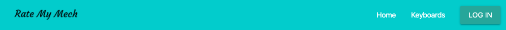
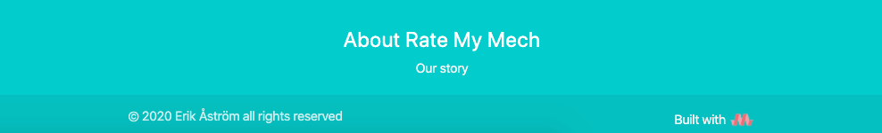
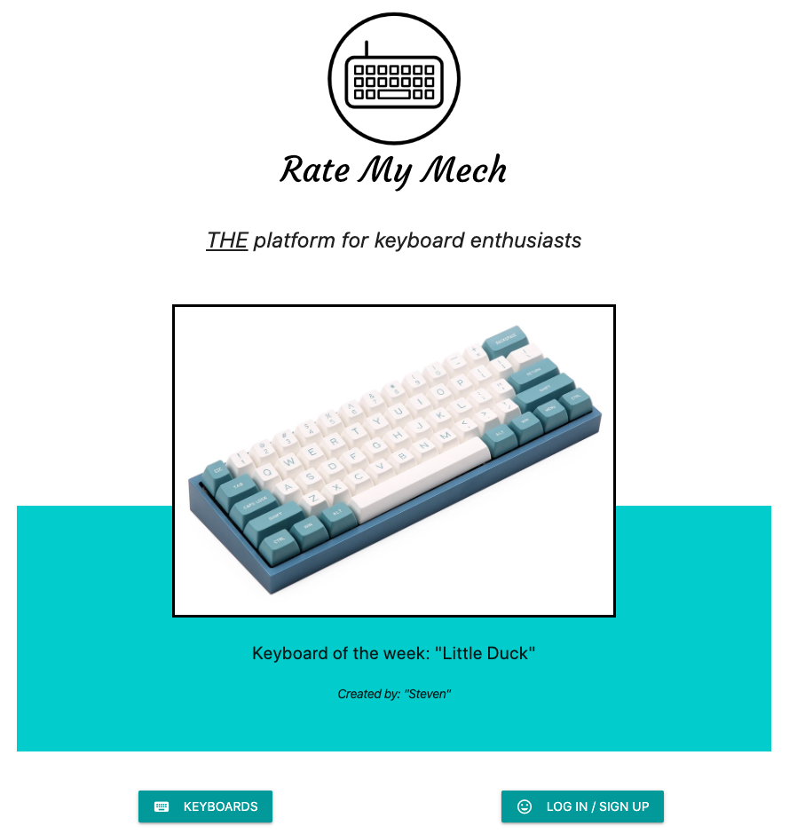
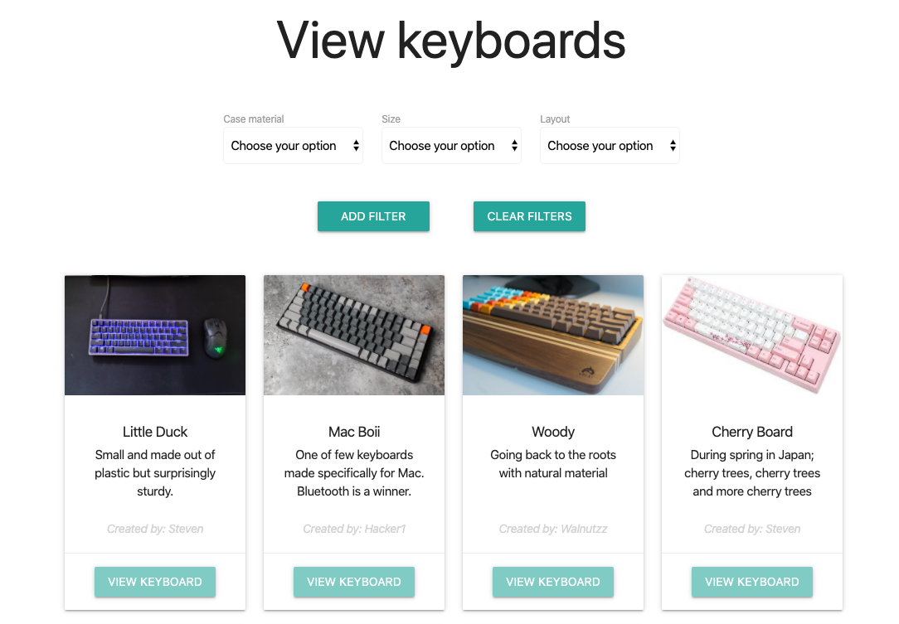
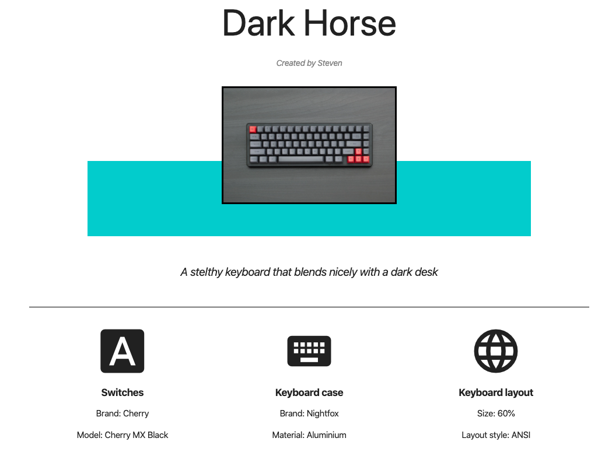
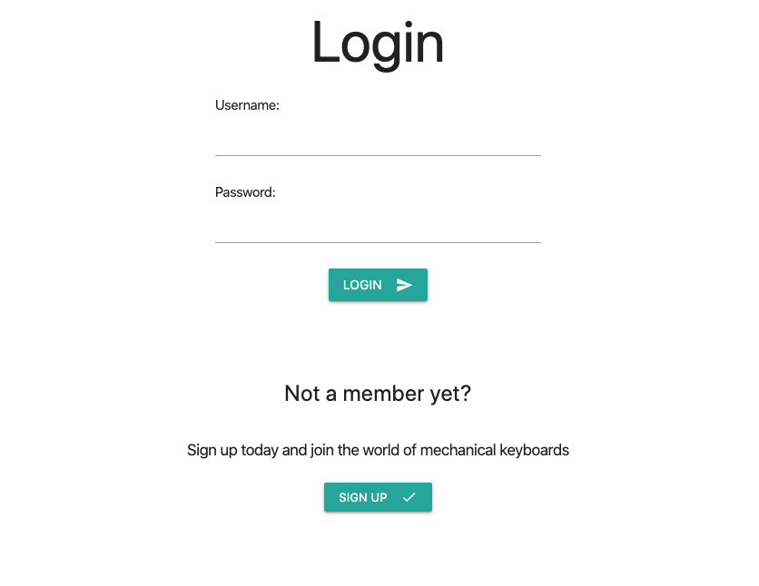
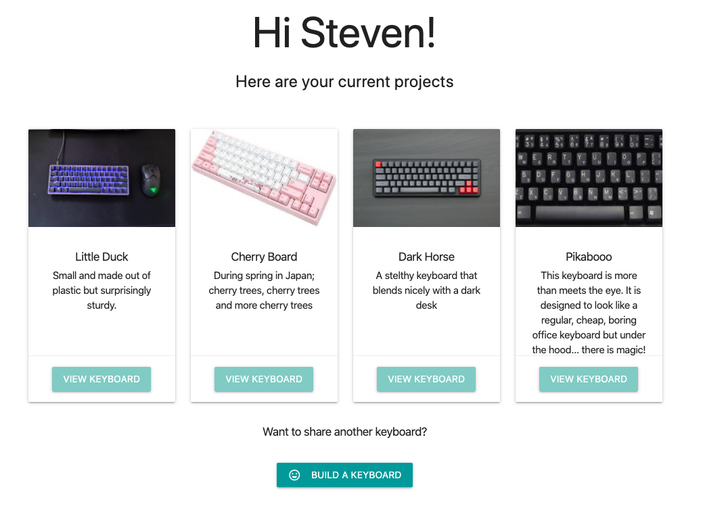
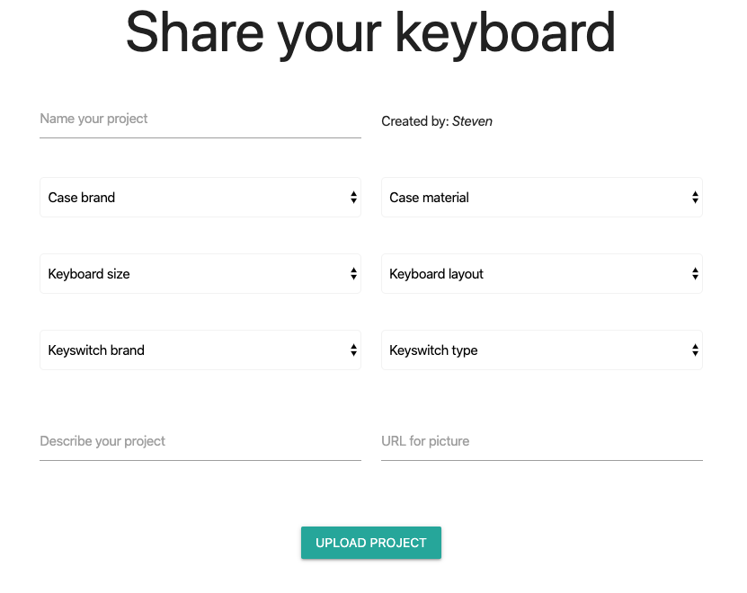
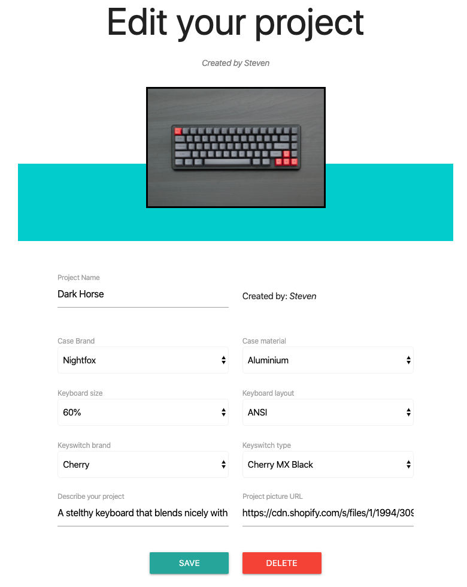

<h1 align="center">
  
</h1>

[View this website through Heroku](https://rate-my-mech.herokuapp.com/) 

Rate My Mech is a community platform for keyboard enthusiats. The application contains different pages depending of if the user is logged in or not. If the user is not logged in the site displays, a home page, a keyboard page for viewing shared keyboards, a login page, an about page and a login/register page. 
If the user is logged in a profile page and a page for building and sharing keyboard are available. The logged in user is also able to edit and delete their own keyboards. 

Rate My Mech was developed by a keyboard enthusiast for other keyboard enthusiats. The main purpose is for users to share their mechanical keyboards and find inspiration from others for their next build. 
The idea of the application is to make it user friendly and as a wise man once said: "good design is invisable", thus the application is kept as clean as possible. 

The goal of the application is:
* Host a user firendly environment which is intuitive by nature
* Provide both front end usability and back end functionality in order to create a full application experience 
* Sperad joy

The users goals are:
* Share their keybords 
* Gain inspiration from others keyboards 

## UX

#### Ideal users are:
* English speaking
* Keyboard enthusiats

#### Users are searching for:
* A community platform for mechanical keyboards 
* A user friendly website which is responsive and suitable for both larger monitors and smaller screen sizes

#### This application make it easy for users to share and gain inspiraton because:
* It is intuitive and easy to use 
* It contains only neccesary features, thus reaching the statement above
* The application provides filter functionality which makes it easier for the user to find what they want

#### User stories 
* As a first time visitor, I want to view others mechanical keyboards to get inspiration
* As a first time visitor, I want to register for an account
* As a first time visitor, I want to (in a simpel way) use the platform to build and share my own mechanical keyboard
* As a returning visitor, I want to be able to log back into my previosly registrated user
* As a returning visitor, I want to be able change previous projects and upload new projects

#### Balsamiq mockups

## Featureas

#### Navigation bar and footer 

The navbar take two shapes depending if the user is logged in or not. If the user is not logged in the following navbar is displayed:

If the user is logged in, more options are available: 

The footer remains the same, not depending of the user being logged in or not:

#### Home 

#### Keyboards 

#### View specific keyboard 

#### Login / Registration 

#### Profile 

#### Build keyboard 

#### Edit / Delete  

#### About 

# Technologies used 

* Python
- Flask
- PythonDNS
* Heroku
* MongoDB

